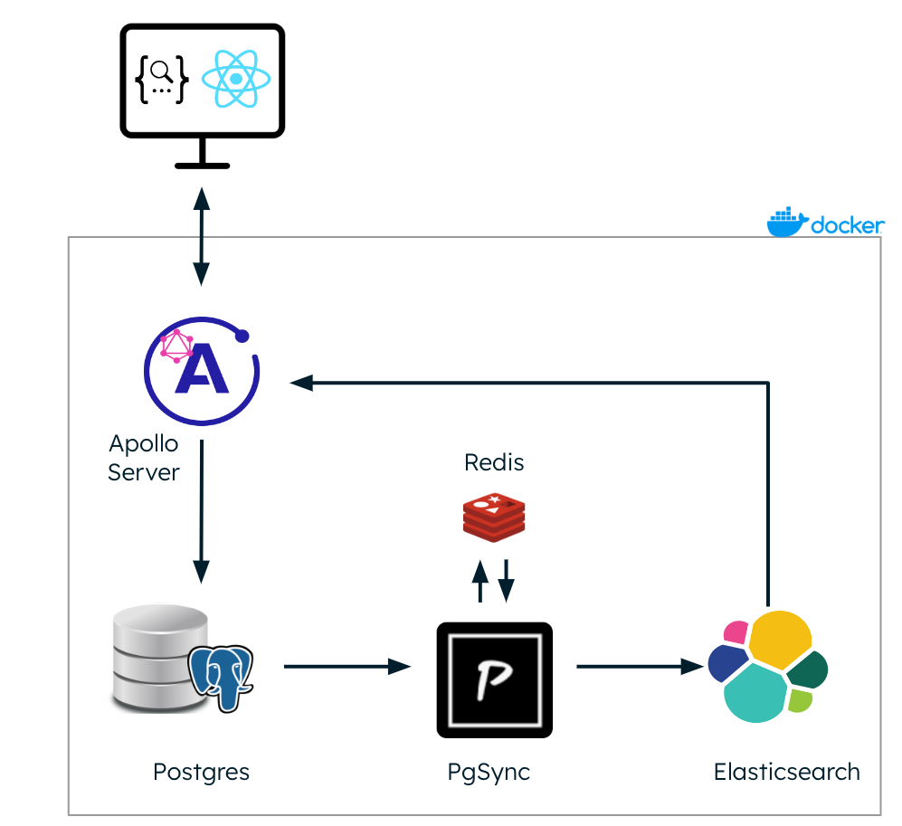
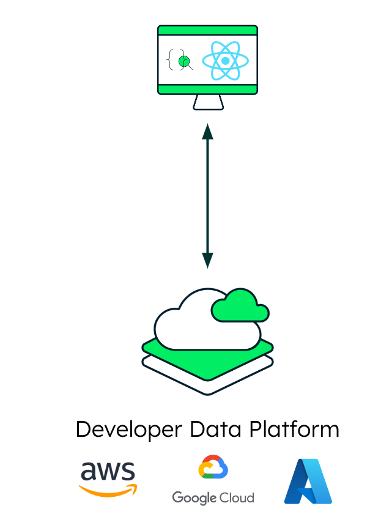

# Welcome to the side by side comparison of an open source application stack and the developer data platform Atlas
The goal of this little project is to help you with a simple but concrete example to make your own descision about using and managing your own application stack versus using a powerful developer data platform like MongoDB Atlas.

The challenge here is to have the same client using two totally different backend implementations providing the same features.


## The On Premise Stack
This stack is Docker based and provides Postgres, Elasticsearch, Apollo Server for GraphQL, PGSync and Redis for database synchronisation



## The MongoDB Atlas Stack
This stack provides you all the features in the same way as the on premise stack using the same React client.



## How to compare?
### On Premise Stack
Make sure Docker and Docker Compose is installed. Then go to the onprem_stack directory and fire the command
```
docker-compose up
```

The process will look like this:


### MongoDB Atlas Stack
Make sure you have the following tools installed:

1. You need the following prerequisits met to follow along
- [MongoDB Atlas Account](https://cloud.mongodb.com) (Free account available, no credit card needed)
- [Atlas CLI](https://www.mongodb.com/tools/atlas-cli)
- [MongoShell](https://www.mongodb.com/docs/v4.4/mongo/)
- [MongoDB Database Tools](https://www.mongodb.com/docs/database-tools/). 
- [NodeJS](https://nodejs.org/)
---
I use Homebrew to do this on MacOS. If you don't have Homebrew, please follow the very simple instructions on the [Hombrew](https://brew.sh/) website to install it. The command below will install all necessary tools at once. If you are using Windows or Linux, see the links above for installation instructions for each component.
```
brew tap mongodb/brew && \
brew install mongodb-atlas-cli mongodb-database-tools node npm
```
2. *(optional)* Generate the autocompletion script for your shell. Learn more following this [link](https://www.mongodb.com/docs/atlas/cli/stable/command/atlas-completion-bash/). Here the example for MacOS 
```
atlas completion zsh > $(brew --prefix)/share/zsh/site-functions/_atlas
```
3. Install [mgenerate](https://github.com/rueckstiess/mgeneratejs) and the [Atlas App Services CLI](https://www.mongodb.com/docs/atlas/app-services/cli/)
```
npm install -g mgeneratejs atlas-app-services-cli
```
- **Restart your shell to use it**

Now you can just enter the ```atlas_stack``` directory and run the ```install.sh``` script. 

The result should look like this:


In addition to the on prem stack you get a fully managed application environment which will scale with your needs and offer a list of very useful features like this:
- Zero downtime deployment
- Failover / High availability
- Low update latency
- Scalability
- Handling inconsistent data
- Data encryption
- Monitoring
- Logging
- Security
- Backup
- Restore
- Disaster recovery
- Automation
- Infrastructure as code
- Cloud agnostic
- Cost effective
